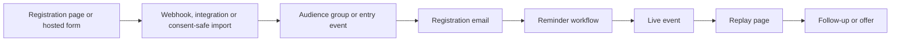

# Campaign systems

An event campaign often fails outside the email editor. Map the full path before changing one component.

Record the owner, URL or identifier, status and verification method for each node. A cloned page may lose its webhook. A replicated campaign can retain the old subject preview, recipients, schedule, social card, links and campaign type. Mailchimp confirms that replication copies content and settings, so treat every copied field as stale until checked.

## Readiness gates

1. **Facts:** Confirm the event date, timezone, presenter, registration route, audience, consent basis, replay destination and offer terms.
2. **Wiring:** Verify the live form submits to the intended integration; the integration writes to the correct audience and group; and downstream workflows listen to that exact entry event. Do not expose the form or send invites until registration, reminder and follow-up paths exist.
3. **Content:** Check every page and email for old dates, links, previews, images, buttons, names, timers and exclusions. Global page components can change several pages at once, so list affected pages before editing one.
4. **Dry run:** Use an internal test contact only when authorised. Submit the actual form, inspect the integration result, confirm group or tag membership, check each queue and render, and remove or clearly label the test record according to the account's data policy.
5. **Freeze:** Name the person who approves final copy and facts. Set a cut-off after which edits require a new verification pass.
6. **Activation:** Re-read every queue and next-send time. Activate only the approved steps in an order justified by those queues. A fixed “bottom-to-top” rule is not a substitute for current queue evidence. Wait for the observed state after each step before continuing.
7. **Post-event:** Verify the replay, checkout and expiry behaviour on desktop and mobile. Record what sent, who was eligible and any gaps before cloning the campaign again.

## Common campaign shapes

### Workshop or in-person event

The registration form usually writes to an event-specific group. A profile or confirmation action can trigger a second email. Later reminders may already contain people held in paused queues. Confirm the event roster against the group, queue and prior sends. A generic confirmation tag can cross event months and should not define the cohort by itself.

### Live webinar

Treat the invite broadcasts, registration email, starting-soon workflow and post-event workflow as one system. Create and verify all workflow entry points before the first invite. Decide whether registration is captured on the company's page or a hosted event page. If contacts are imported from a hosted platform, retain their actual marketing status. Mailchimp requires permission before an imported contact is treated as subscribed.

The last day invite often needs a different exclusion from earlier invites because registrants may also receive reminder emails. Verify the event-specific group is populated at registration before using it as an exclusion.

### Monthly repeat of a webinar (lessons from a one-month handover, Sep 2026)

**Fill every fact you can know**
- When the build is being handed to a colleague, the owner wants every email ready to send. Don't leave square-bracket notes or questions for other people inside the copy.
- Fill every fact you can know or reasonably infer:
  - presenters, event day and time, and session length from the plan
  - offer deadline and cohort date
  - guarantee and offer wording from last month's live email, when the offer is unchanged
- Write day-relative wording for each email's send day, for example "TOMORROW, Sunday, midnight UK" on Saturday and "TONIGHT at midnight UK" on Sunday.

**Don't placeholder fixed links**
- The replay page and the checkout link stayed the same every month in one account (`/replay/`, `/checkouts/<code>/`). Replacing them with placeholders created rework. Change a link only if the owner says it moves.

**Lines that depend on the live event**
- For timestamps, a quote or a highlight, write the line from the planned run order, so it is true if the session goes as planned. For example, use a "What's in the replay" list instead of timestamps.
- Remove quotes from people who won't attend.
- List which emails to recheck if the session changes. Don't leave instructions inside the email.
- If placeholders really are needed (for example a Zoom link that doesn't exist yet), visible capitals in brackets plus a holding URL on the company domain with a fragment (`https://example.com/#ZOOM-LINK`) were accepted by Mailchimp and easy to search for later. Fill them as soon as the facts exist.

**Countdown timer**
- Duplicate last month's timer in the timer service (for example Sendtric's duplicate icon on the timer list), so the colours and layout stay the same.
- Rename it, set the end date, time and timezone in its configuration, and save.
- Reload to check the name, date and timezone, and fetch the image URL to confirm it returns a GIF showing the right time remaining.
- Then replace the old timer code wherever it appears.

**Invites**
- Replicate last month's sent invites as unscheduled drafts. Only an invite that used a countdown needs the image swapped.
- The final same-day invite excludes the event's registrant group. After replicating, change that condition to the new month's group.
- If the copy still carries last month's dates, put a clear marker such as "REWRITE BEFORE SENDING" in the internal title until it is updated.

### Cohort upsell

Freeze the source cohort before building recipients. Exclude refunds, scholarships or other non-selling cases only from current authorised evidence. Later emails can target recipients of the first campaign and exclude buyers, but verify that the purchase tag is applied quickly and reliably. Confirm the offer, access terms, sales page, replay visibility and expiry before sending a test.

Take the deadline from the live sales page, not from the brief. A page builder's countdown widget usually carries its absolute end in the page source (for example an Elementor countdown's `data-date` Unix timestamp, plus any expire action such as a redirect). Convert it to the audience's timezone. Then align three things with it: relative wording in the copy ("closes Sunday at midnight UK"), subjects and previews that mention a day, and any countdown image. A second timer on the same page (for example a fast-action bonus) may end much earlier than the offer.

Make the emails match the live sales page item by item: component names, durations, which items are bonuses, prices and instalments. Where the page and an email differ, the page is the reference unless the owner says otherwise. When a colleague's asset (an infographic or slide) lists items the page does not, tell the operator and note that raising it may create page work; it does not always need to be fixed before sending.

Access-duration rules can differ by component. In one account, lifetime access was allowed for courses and on-demand training but not for community, software or an evaluation platform. Confirm which components a rule covers before deleting every mention of a keyword; a blanket keyword removal once took out an allowed image that then had to be restored.

When the first email depends on an event recording, schedule it only once the recording plays at the linked page, and write a fallback for a late upload. When the event date moves, follow the previous cohort's cadence and send times as the baseline (for example one email a day to the deadline), rename the drafts to the new dates, and check every day-relative phrase still reads correctly on its new send day.

### Cohort downsell alongside an existing sequence

When the owner already runs a proven sequence, keep their emails on their usual days and fit the new emails into the gaps. That keeps a baseline to compare against and respects their process. Leave the owner's emails as they are unless the operator approves specific changes; list stale facts (old codes, dates, features) as questions for the owner instead of rewriting them. Check that every email in the sequence uses the same offer code and deadline.

Confirm product rules with the owner before relying on a slide or brief. Planning documents can carry superseded rules, such as a waiting period the owner never meant to enforce, and a mistaken rule in the copy can undo the whole angle. Keep regulated or capital-related claims to wording the owner has approved.

Where emails promote a paid membership that also includes an assessment or evaluation route, present the membership's ongoing value first and the route as included at no extra cost. Leading with evaluation can make the product read as a fee to be assessed.

## Handoff record

For a colleague taking over, provide one current manifest rather than a screen recording alone. Include the campaign purpose, owners, accounts needed, dependency map, exact target cohort, source templates, event and offer facts, all campaign IDs, approved final states, activation date and time, test recipients, evidence locations and unresolved decisions. Mark each item as verified, pending or historical.

Sources: [Replicate a Campaign](https://mailchimp.com/help/replicate-a-campaign/), [Edit an Active Classic Automation](https://mailchimp.com/help/edit-an-active-classic-automation/), [About Your Contacts](https://mailchimp.com/help/about-your-contacts/) and [Format Guidelines for Your Import File](https://mailchimp.com/help/format-guidelines-for-your-import-file/).
