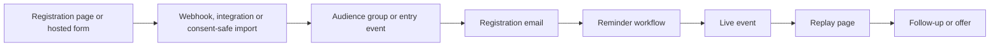

# Campaign systems

An event campaign often fails outside the email editor. Map the full path before changing one component.

Record the owner, URL or identifier, status and verification method for each node. A cloned page may lose its webhook. A replicated campaign can retain the old subject preview, recipients, schedule, social card, links and campaign type. Mailchimp confirms that replication copies content and settings, so treat every copied field as stale until checked.

## Readiness gates

1. **Facts:** Confirm the event date, timezone, presenter, registration route, audience, consent basis, replay destination and offer terms.
2. **Wiring:** Verify the live form submits to the intended integration; the integration writes to the correct audience and group; and downstream workflows listen to that exact entry event. Do not expose the form or send invites until registration, reminder and follow-up paths exist.
3. **Content:** Check every page and email for old dates, links, previews, images, buttons, names, timers and exclusions. Global page components can change several pages at once, so list affected pages before editing one.
4. **Dry run:** Use an internal test contact only when authorised. Submit the actual form, inspect the integration result, confirm group or tag membership, check each queue and render, and remove or clearly label the test record according to the account's data policy.
5. **Freeze:** Name the person who approves final copy and facts. Set a cut-off after which edits require a new verification pass.
6. **Activation:** Re-read every queue and next-send time. Activate only the approved steps in an order justified by those queues. A fixed “bottom-to-top” rule is not a substitute for current queue evidence. Wait for the observed state after each step before continuing.
7. **Post-event:** Verify the replay, checkout and expiry behaviour on desktop and mobile. Record what sent, who was eligible and any gaps before cloning the campaign again.

## Common campaign shapes

### Workshop or in-person event

The registration form usually writes to an event-specific group. A profile or confirmation action can trigger a second email. Later reminders may already contain people held in paused queues. Confirm the event roster against the group, queue and prior sends. A generic confirmation tag can cross event months and should not define the cohort by itself.

### Live webinar

Treat the invite broadcasts, registration email, starting-soon workflow and post-event workflow as one system. Create and verify all workflow entry points before the first invite. Decide whether registration is captured on the company's page or a hosted event page. If contacts are imported from a hosted platform, retain their actual marketing status. Mailchimp requires permission before an imported contact is treated as subscribed.

The last day invite often needs a different exclusion from earlier invites because registrants may also receive reminder emails. Verify the event-specific group is populated at registration before using it as an exclusion.

### Cohort upsell

Freeze the source cohort before building recipients. Exclude refunds, scholarships or other non-selling cases only from current authorised evidence. Later emails can target recipients of the first campaign and exclude buyers, but verify that the purchase tag is applied quickly and reliably. Confirm the offer, access terms, sales page, replay visibility and expiry before sending a test.

## Handoff record

For a colleague taking over, provide one current manifest rather than a screen recording alone. Include the campaign purpose, owners, accounts needed, dependency map, exact target cohort, source templates, event and offer facts, all campaign IDs, approved final states, activation date and time, test recipients, evidence locations and unresolved decisions. Mark each item as verified, pending or historical.

Sources: [Replicate a Campaign](https://mailchimp.com/help/replicate-a-campaign/), [Edit an Active Classic Automation](https://mailchimp.com/help/edit-an-active-classic-automation/), [About Your Contacts](https://mailchimp.com/help/about-your-contacts/) and [Format Guidelines for Your Import File](https://mailchimp.com/help/format-guidelines-for-your-import-file/).
